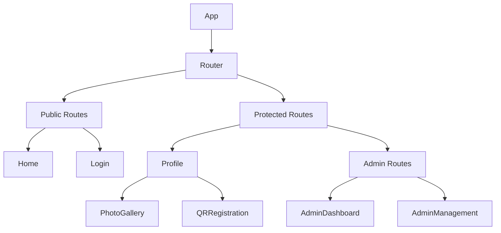
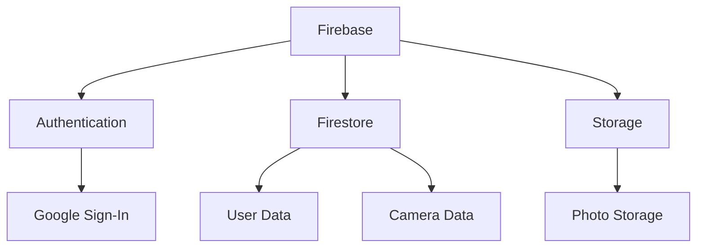

# System Architecture

## Overview
The Fremont Photo Application is a React-based web application with Firebase backend services. The architecture follows a modern, component-based approach with clear separation of concerns.

## System Components

### Frontend Architecture

### Backend Architecture

## Data Flow

### Authentication Flow
1. User attempts to access protected route
2. AuthContext checks authentication status
3. If not authenticated, redirects to login
4. After successful login, user data is stored in context
5. Protected routes are rendered based on user role

### Camera Registration Flow
1. User scans QR code or visits registration URL
2. System validates QR code ID
3. User is prompted to login if not authenticated
4. Camera is associated with user's profile
5. User is redirected to profile page

### Photo Management Flow
1. User uploads photo in PhotoGallery
2. Photo is compressed and uploaded to Firebase Storage
3. Photo URL is stored in camera document
4. UI updates optimistically
5. Photo grid is refreshed with new data

## Component Hierarchy

### Core Components
- **App**: Root component with routing and context providers
- **Navbar**: Navigation and authentication status
- **AuthContext**: Authentication state management
- **AdminRoute**: Protected route wrapper for admin pages

### Feature Components
- **Profile**: User's camera management
- **PhotoGallery**: Camera-specific photo display
- **QRRegistration**: Camera registration interface
- **AdminDashboard**: Administrative interface
- **AdminManagement**: User management interface

## State Management

### Global State
- Authentication state (AuthContext)
- User profile data
- Admin status

### Local State
- Component-specific UI state
- Form data
- Loading states
- Error handling

## Security Architecture

### Authentication
- Google Sign-In integration
- JWT token management
- Session persistence

### Authorization
- Role-based access control
- Protected routes
- Firebase security rules

### Data Protection
- Input validation
- Data sanitization
- Secure file uploads

## Performance Architecture

### Frontend Optimization
- Code splitting
- Lazy loading
- Image optimization
- Caching strategies

### Backend Optimization
- Firestore indexing
- Storage optimization
- Caching rules
- Batch operations

## Scalability Considerations

### Horizontal Scaling
- Stateless components
- Firebase auto-scaling
- CDN integration

### Vertical Scaling
- Optimized queries
- Efficient data structures
- Proper indexing

## Monitoring and Logging

### Frontend Monitoring
- Error boundaries
- Performance metrics
- User analytics

### Backend Monitoring
- Firebase Analytics
- Error tracking
- Usage metrics

## Deployment Architecture

### Development
- Local development server
- Firebase emulators
- Hot reloading

### Production
- Firebase Hosting
- CDN distribution
- Automated deployments

## Future Architecture Considerations

### Planned Improvements
- Microservices architecture
- Advanced caching
- Real-time updates
- Offline support

### Scalability Roadmap
- Database sharding
- Load balancing
- Advanced caching
- Edge computing 