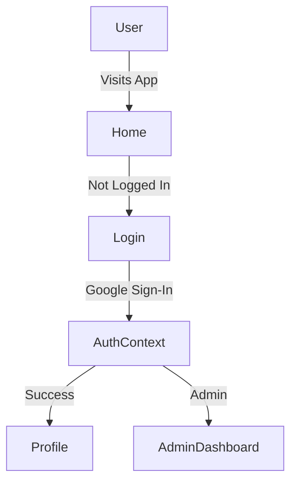
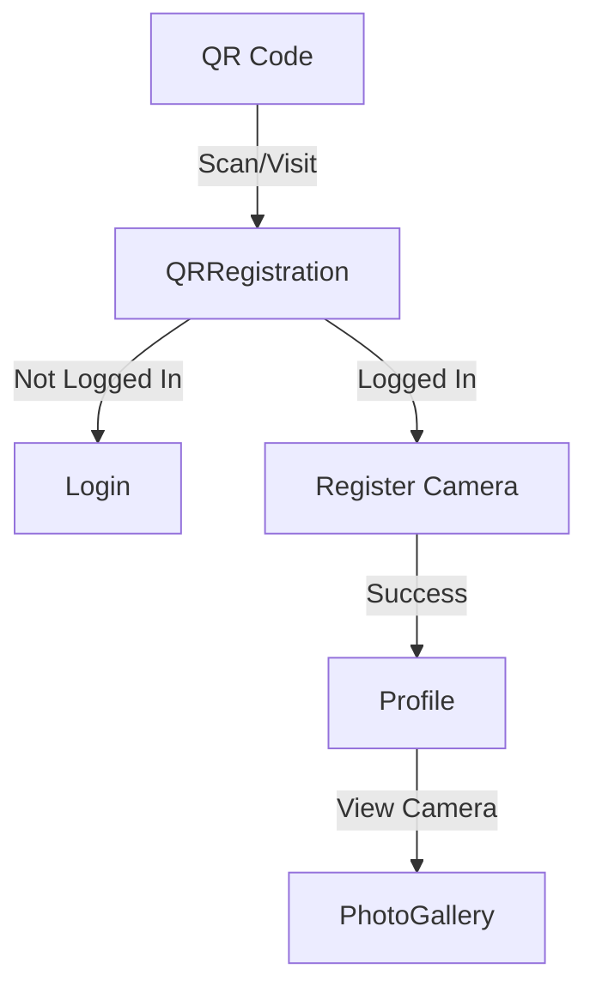
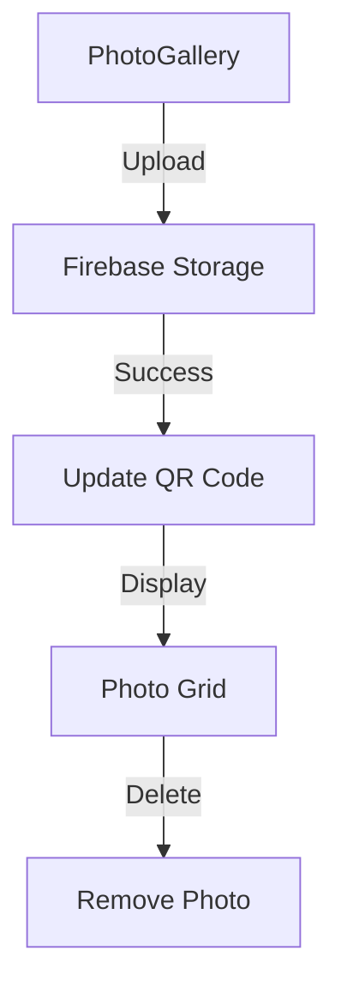

# Technical Documentation

## Data Structure

### Firestore Collections

#### `qrCodes` Collection
Each document represents a unique camera with the following fields:
```typescript
{
  id: string;              // Document ID and camera identifier
  createdAt: Timestamp;    // Creation timestamp
  photos: string[];        // Array of photo storage URLs
  shippingLabel: {         // Shipping information (optional)
    trackingNumber: string;
    carrier: string;
    status: string;
    createdAt: Timestamp;
    labelUrl?: string;     // URL to shipping label (optional)
  };
  createdBy: string;       // UID of admin who created the QR code
  status: string;          // 'Active' | 'Registered' | 'Inactive'
  userId: string | null;   // UID of user who registered the camera
}
```

#### `users` Collection
Each document represents a user profile with the following fields:
```typescript
{
  uid: string;             // User's Firebase Auth UID
  email: string;           // User's email
  isAdmin: boolean;        // Admin status
  cameras: [{              // Array of cameras registered to user
    id: string;            // Camera/QR code ID
    name: string;          // Display name (e.g., "Camera 123")
    status: string;        // Camera status
    createdAt: Timestamp;  // Registration timestamp
  }];
  createdAt: Timestamp;    // Account creation timestamp
}
```

### Firebase Storage Structure
```
qr-codes/
  ├── {qrCodeId}/
  │   ├── {photo1.jpg}
  │   ├── {photo2.jpg}
  │   └── ...
  └── ...
```

## Component Relationships

### Authentication Flow


### Camera Registration Flow


### Photo Management Flow


## Component Styling
- Navigation
  - Responsive navbar with mobile menu
  - Consistent button styling
    - Gradient backgrounds
    - Hover effects
    - Icon integration
  - Mobile-first approach
    - Centered content
    - Touch-friendly targets
    - Proper spacing

- Buttons
  - Primary Actions
    - Blue gradient background
    - White text
    - Icon + text layout
    - Responsive padding
  - Interactive States
    - Hover: transform + shadow
    - Active: remove transform
    - Disabled: opacity + cursor
  - Mobile Considerations
    - Larger touch targets
    - Centered content
    - Consistent spacing

## Security Rules

### Firestore Rules
```javascript
rules_version = '2';
service cloud.firestore {
  match /databases/{database}/documents {
    // Users can read their own data
    match /users/{userId} {
      allow read: if request.auth != null && request.auth.uid == userId;
      allow write: if request.auth != null && request.auth.uid == userId;
    }
    
    // QR Codes
    match /qrCodes/{qrCodeId} {
      // Admins have full access
      allow read, write: if request.auth != null && 
        get(/databases/$(database)/documents/users/$(request.auth.uid)).data.isAdmin == true;
      
      // Users can read their own cameras
      allow read: if request.auth != null && 
        resource.data.userId == request.auth.uid;
      
      // Users can update their own cameras
      allow update: if request.auth != null && 
        resource.data.userId == request.auth.uid;
    }
  }
}
```

### Storage Rules
```javascript
rules_version = '2';
service firebase.storage {
  match /b/{bucket}/o {
    match /qr-codes/{qrCodeId}/{allPaths=**} {
      // Admins have full access
      allow read, write: if request.auth != null && 
        firestore.get(/databases/(default)/documents/users/$(request.auth.uid)).data.isAdmin == true;
      
      // Users can read their own photos
      allow read: if request.auth != null && 
        firestore.get(/databases/(default)/documents/qrCodes/$(qrCodeId)).data.userId == request.auth.uid;
      
      // Users can upload to their own cameras
      allow write: if request.auth != null && 
        firestore.get(/databases/(default)/documents/qrCodes/$(qrCodeId)).data.userId == request.auth.uid;
    }
  }
}
```

## API Endpoints

### Firebase Functions
1. **Generate Shipping Label**
   - Endpoint: `/generateLabel`
   - Method: POST
   - Body: `{ qrCodeId: string }`
   - Returns: `{ trackingNumber: string, labelUrl: string }`

2. **Delete Camera**
   - Endpoint: `/deleteCamera`
   - Method: DELETE
   - Body: `{ qrCodeId: string }`
   - Returns: `{ success: boolean }`

## Performance Considerations

1. **Photo Optimization**
   - Images are compressed before upload
   - Thumbnails are generated for gallery view
   - Lazy loading implemented for photo grid

2. **Data Loading**
   - Pagination for large photo galleries
   - Caching of frequently accessed data
   - Optimistic updates for UI responsiveness

3. **Mobile Optimization**
   - Responsive image sizes
   - Touch-friendly interfaces
   - Offline support for basic functionality 